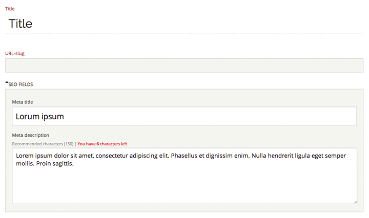

# Statamic SEO plugin

Just a simple Meta SEO plugin. Making clients happy!  The meta description field counts characters. By default the fieldset is collapsed, so clients can focus on there content.

## Installation

Clone or download the project and add the contents of archive to the `_add-ons/seo` folder.

## Add seo-field to your fieldset(s)

	seo-title:
    	display: SEO fields
    	required: false
    	default:
    	type: seo
    	
 Or better reuse the fieldset with include
 	
	include:
  		- seo

### Disclaimer
This is my first Statamic plugin and I have 'written' this plugin for my own use. It comes without any guarantee. If you find bugs or have great additions you'd like to share, use github to fork the project and share your improvements by initiating pull requests. 